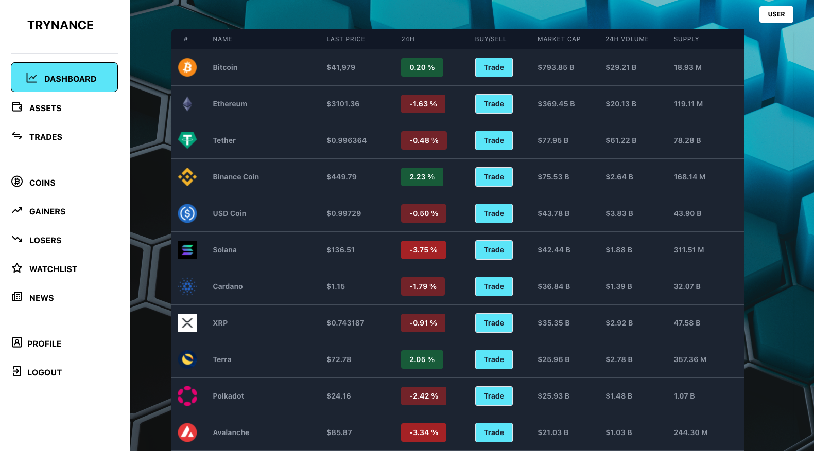

# Trynance

   

Tryance is crytpocurrency exchange where users can find digital assets, exchange fiat and crypto currencies, add coins to a watchlist, and read financial news. All users begin with $1000 USD. Trynance's goal is to educate users about digital currencies and give them an environment to learn and trade them without risking financial loss.

## Table of Contents
1. [Deployment](#Deployment)
2. [Technologies Used](#TechnologiesUsed)
    * [Front End](#FrontEnd)
    * [Back End](#BackEnd)
    * [Database](#Database)
    * [APIs](#APIs)
2. [Backend](#Backend)
3. [Deployment](#Deployment)
4. [Video Demo](#VideoDemo)
5. [Demo Acount for Site Use](#DemoAccountForSiteUse)
6. [Features](#Features)
7. [Local Deployment](#LocalDeployment)
8. [Testing](#Testing)

### Deployment
No deployment yet. Still putting the finishing touces on v.1.0

### Technologies Used
<b>Front-End:</b> React, Tailwind

<b>Back-End:</b> Node.js, Express.js, bcrypt

<b>Database:</b> PostgreSQL

<b>APIs:</b> Coin Data - <a href='https://www.coingecko.com/en/api/documentation'>Coin Gecko</a>, Crypto News - <a href='https://cryptopanic.com/developers/api/'>Cryptopanic</a>

<b>Graphics:</b> Adobe Photoshop

###  Backend
<a href='https://github.com/zataara/trynance-backend'>Backend Repository</a>

### Video Demo
Will be available upon deployment.

### Demo Acount for Site Use

Trynance uses User Registration and Login to save a users data. If you do not wish to create your own account you may use the test account below:

<b>Username:</b> test
<b>Password:</b> test

### Features
- User Registration and Login
- Real-Time, Live-Refreshing of Coin Data
- Save favorite coins to a watchlist
- Use fiat to trade any coin
- Browse crypto news

### Local Deployment
##### Backend and DB:
Download and install the latest version of postgres <a href='https://www.postgresql.org/download/'>here</a>.

Create both a production and testing database:
`
createdb trynance
`
`
createdb trynance-test
`

Clone the backend repo:
`
git clone https://github.com/zataara/trynance-backend.git
`

Change to root directory:
`
cd trynance-backend
`

Install packages:
`
npm install
`

Change to sql directory:
`
cd sql
`

Open postrgres, set db schema and seed both dbs:
`
psql \i trynance.sql
`

Move back a directory:
`
cd ..
`

Start backend server:
`
npm start
`

##### Frontend:
Clone the frontend repo:
`
git clone https://github.com/zataara/trynance-frontend.git
`

Change to root directory:
`
cd trynance-frontent
`

Install packages:
`
npm install
`

Start frontend server:
`
npm start
`

### Testing

To run tests in either repository, in the root directory run:
`
npm test
`
